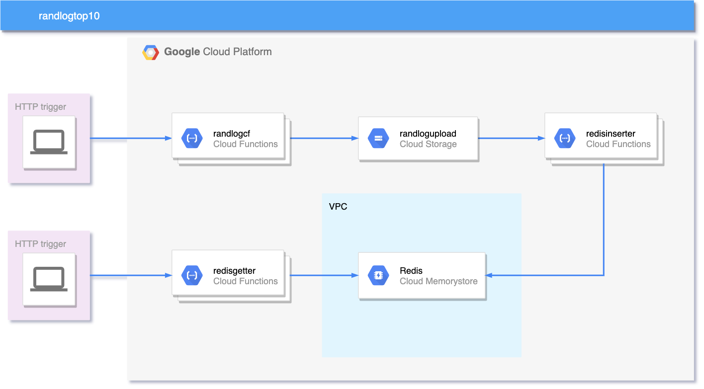

# Randlogtop10

## Context:
Randlogtop10 is meant to be a part of the [Cloud Operations Sandbox](https://cloud.google.com/blog/products/operations/on-the-road-to-sre-with-cloud-operations-sandbox), a click-to-deploy open source repo that helps practitioners exercise GCP in an isolated cloud environment with synthetic traffic that is similar to production. This work sets up a triggerable serverless leaderboard that returns top 10 IP addresses that have “visited” the synthetic system. This repository is not an official Google product.

Checkout the [Cloud Operations Sandbox repo](https://github.com/GoogleCloudPlatform/cloud-ops-sandbox) and deploy right to [Cloud Shell](https://cloud-ops-sandbox.dev/).

## Architecture

## What's in the repo?
The first Cloud Function **randlogcf** when triggered generates a 255k line log file of the schema *timestamp, request_type, path, ip_address*, and then deposits it in a GCS bucket. This bucket has a [google.storage.object.finalize](https://cloud.google.com/functions/docs/calling/storage#object_finalize) trigger that triggers the second Cloud Function **redisinserter**, which then reads the file and inserts the IP addresses as keys into a [Redis Sorted Set](https://redislabs.com/ebook/part-2-core-concepts/chapter-3-commands-in-redis/3-5-sorted-sets/) “ipaddr”, contained within a Memorystore Redis instance. The third Cloud Function **redisgetter**, when triggered via HTTP will retrieve the top 10 IPs with counts from Redis using [zrevrange](https://redis.io/commands/zrevrange) and return them as JSON.

Infrastructure is deployed and managed via Terraform with state managed in a GCS bucket.

## How to use
#TODO: Add deployment and usage instructions.

## How do destroy
#TODO: Add tear down instructions.

## How to file feature requests?
File issues for feature requests.
